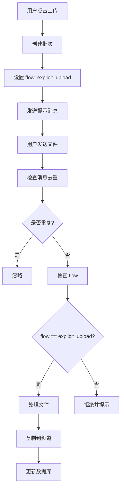
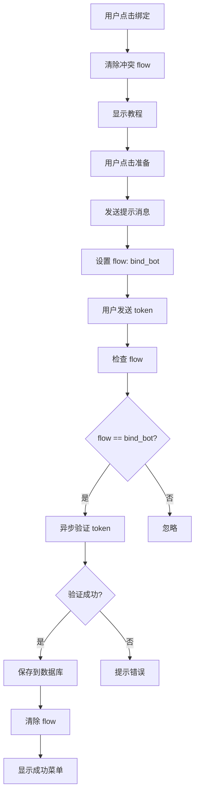
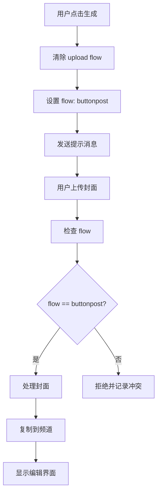

# 并发与会话问题修复 - 技术文档

## 概述

本次改造针对 kkzz3399/xbfilebot-demo 仓库的 debug 分支，修复了"抢消息/抢上传/文本被误当作其它输入"等并发与会话问题，并简化了启动日志为中文。

## 核心问题

### 问题1：消息被多个处理器抢占
**表现：**
- 用户在上传流程中发送文件，被广告图处理器误处理
- 绑定机器人时发送的 token 被其他文本处理器拦截

**原因：**
- 缺乏统一的 flow（流程）管理机制
- 各个处理器独立判断消息，容易产生竞态条件

### 问题2：回调按钮无响应
**表现：**
- 用户点击某些按钮后，界面一直显示加载状态

**原因：**
- 某些 callback_data 没有对应的处理器
- 没有兜底机制来 answer 未匹配的 callback

### 问题3：消息重复处理
**表现：**
- 同一消息被多次处理，导致重复上传

**原因：**
- 缺乏消息去重机制

### 问题4：日志难以理解
**表现：**
- 启动日志全是英文，难以快速了解状态

## 解决方案

### 1. DB-backed Flow 管理系统

**文件：** `utils/flowguards.py`

**核心功能：**
- 使用 SQLite 持久化用户流程状态
- 支持 TTL 自动过期
- 线程安全操作（db_lock）

**API：**
```python
# 设置流程
flowguards.set_flow(user_id, "explicit_upload", {
    "batch_id": batch_id,
    "ts": int(time.time())
}, ttl=3600)

# 获取流程（自动清理过期）
flow = flowguards.get_flow(user_id)

# 清除流程
flowguards.clear_flow(user_id)

# 更新步骤
flowguards.update_step(user_id, {"expect": "upload"})

# 更新元数据
flowguards.set_meta(user_id, {"batch_id": "new_batch"})
```

**数据库结构：**
```sql
CREATE TABLE user_flows (
    user_id INTEGER PRIMARY KEY,
    flow_name TEXT NOT NULL,
    step_json TEXT,
    meta_json TEXT,
    created_at INTEGER NOT NULL,
    ttl INTEGER
)
```

### 2. 消息去重机制

**文件：** `handlers/upload.py`

**实现：**
```python
_processed_messages = {}  # {message_id: timestamp}
MESSAGE_DEDUP_TTL = 10  # 10秒

async def _is_duplicate_message(message_id):
    async with _dedup_lock:
        now = int(time.time())
        # 清理过期记录
        expired = [mid for mid, ts in _processed_messages.items() 
                   if now - ts > MESSAGE_DEDUP_TTL]
        for mid in expired:
            del _processed_messages[mid]
        
        # 检查重复
        if message_id in _processed_messages:
            return True
        
        # 记录
        _processed_messages[message_id] = now
        return False
```

### 3. ReplyKeyboard 主导航

**文件：** `handlers/start.py`

**核心改进：**
- 使用 ReplyKeyboardMarkup 替代 InlineKeyboardMarkup 作为主菜单
- 基于用户权限动态生成按钮
- 文本按钮精确匹配路由

**菜单结构：**
```python
def _create_main_reply_keyboard(user_id):
    if is_admin(user_id):
        # 管理员视图
        buttons = [
            [📤 开始上传, 📁 管理文件夹],
            [🔐 绑定机器人, 🔒 已授权机器人],
            [👤 个人信息, 💎 会员中心],
            [📣 广播, ➕ 添加管理员]
        ]
    elif is_vip(user_id):
        # VIP 视图
        buttons = [
            [📤 开始上传, 📁 管理文件夹],
            [🔐 绑定机器人, 🔒 已授权机器人],
            [👤 个人信息, 💎 会员中心],
            [📣 广播]
        ]
    else:
        # 普通用户视图
        buttons = [
            [💳 购买会员, 🔐 兑换卡密],
            [🔐 绑定机器人, 🔒 已授权机器人],
            [👤 个人信息, 💎 会员中心]
        ]
    return ReplyKeyboardMarkup(buttons, resize_keyboard=True)
```

### 4. 回调兜底处理器

**文件：** `handlers/callback_fallback.py`

**实现：**
```python
FALLBACK_HANDLER_PRIORITY = 9999

@app.on_callback_query(group=FALLBACK_HANDLER_PRIORITY)
async def _callback_fallback_handler(client, cb):
    user_id = cb.from_user.id if cb.from_user else "unknown"
    callback_data = cb.data or ""
    msg_id = cb.message.id if cb.message else "unknown"
    
    print(f"[callback_fallback] 收到未匹配 callback -> "
          f"data='{callback_data}', from={user_id}, msg_id={msg_id}")
    
    await cb.answer()  # 避免 UI 卡住
```

### 5. 中文启动日志

**文件：** `main.py`

**改进前：**
```
[main] register_vipscenter called
[main] vipscenter.bindbot imported successfully
[main] bindbot.register_bindbot called
机器人已启动。
```

**改进后：**
```
==================================================
🚀 云存储机器人正在启动...
==================================================
📊 数据库初始化完成
📝 注册核心处理器...
✅ VIP 中心模块已注册
✅ 机器人绑定模块导入成功
✅ 机器人绑定处理器已注册
✅ 机器人已启动成功
```

### 6. 辅助函数提取

**文件：** `utils/helpers.py`

**新增函数：**
```python
def get_user_folders(user_id, limit=50):
    """获取用户的文件夹列表"""
    cursor.execute("""
        SELECT batch_id, folder_name, total_photos, 
               total_videos, total_other, forward_allowed
        FROM batches
        WHERE user_id = ? AND status = 'finished' 
              AND folder_name IS NOT NULL AND folder_name != ''
        ORDER BY timestamp DESC
        LIMIT ?
    """, (user_id, limit))
    # ... 返回规范化的 tuple 列表
```

## Flow 管理详细流程

### 上传流程（explicit_upload）



### 绑定机器人流程（bind_bot）



### 广告图流程（buttonpost）



## 处理器优先级

```
-1000: bindbot 回调处理器（高优先级）
-500:  upload 早期文本守护（防止 bind_bot 文本被抢）
0:     核心处理器（upload, buttonpost 等）
1:     通用处理器（common）
9999:  callback_fallback（最低优先级）
```

## 线程安全保证

1. **数据库操作：** 使用 `db_lock` 保护所有写操作
2. **Flow 操作：** flowguards 内部使用锁保护
3. **消息去重：** 使用异步锁 `_dedup_lock`

## 性能优化

1. **Flow TTL：** 自动清理过期 flow，避免内存泄漏
2. **消息去重：** 定期清理过期记录
3. **数据库索引：** user_id 作为主键，快速查询
4. **连接复用：** 使用 db.py 的 cursor proxy

## 错误处理

1. **数据库错误：** 所有 DB 操作都有异常捕获
2. **导入错误：** flowguards 有本地 SQLite 降级方案
3. **验证超时：** bindbot 使用 asyncio.wait_for 限制超时
4. **未匹配回调：** callback_fallback 捕获并记录

## 向后兼容

1. **DB Schema：** 没有修改现有表结构
2. **API：** 保留了所有原有功能
3. **业务逻辑：** 仅在入口处增加守护，核心逻辑不变

## 文件变更总结

### 新增文件
- `handlers/callback_fallback.py` - 回调兜底处理器
- `.gitignore` - Git 忽略文件
- `TESTING_GUIDE.md` - 测试指南
- `TECHNICAL_DOC.md` - 本技术文档

### 修改文件
- `main.py` - 中文日志 + 注册 callback_fallback
- `handlers/start.py` - ReplyKeyboard + 文本路由
- `handlers/common.py` - 使用 get_user_folders helper
- `handlers/upload.py` - 消息去重
- `utils/flowguards.py` - DB-backed + TTL
- `utils/helpers.py` - 新增 get_user_folders

### 未修改但相关的文件
- `handlers/buttonpost.py` - 已有 flow 检查
- `vipscenter/bindbot.py` - 已有 reply-to-prompt
- `handlers/broadcast.py` - 保持不变
- `db.py` - 保持不变

## 测试建议

详细的测试指南请参考 `TESTING_GUIDE.md`。

关键测试点：
1. ReplyKeyboard 显示
2. 上传流程隔离
3. 绑定机器人 reply-to-prompt
4. 消息去重
5. 回调兜底
6. Flow TTL

## 部署说明

1. 拉取 debug 分支最新代码
2. 确保依赖已安装：`pip install -r requirements.txt`
3. 启动机器人：`python3 main.py`
4. 观察启动日志确认所有模块正常注册
5. 使用测试账号进行功能测试

## 已知限制

1. Flow 存储在本地数据库，重启不会丢失
2. 消息去重仅在内存中，重启会清空
3. TTL 检查在每次 get_flow 时进行，不是后台任务

## 未来改进建议

1. 添加 Flow 统计和监控
2. 实现 Flow 可视化管理界面
3. 添加更多单元测试
4. 考虑使用 Redis 替代 SQLite（如果需要分布式）

## 维护注意事项

1. 新增处理器时注意设置合适的 group 优先级
2. 多步交互流程应使用 flowguards 管理状态
3. 重要的回调都应有对应的处理器
4. 定期检查 callback_fallback 的日志，发现遗漏的回调

## 联系方式

如有问题，请在 GitHub 仓库提交 Issue。
